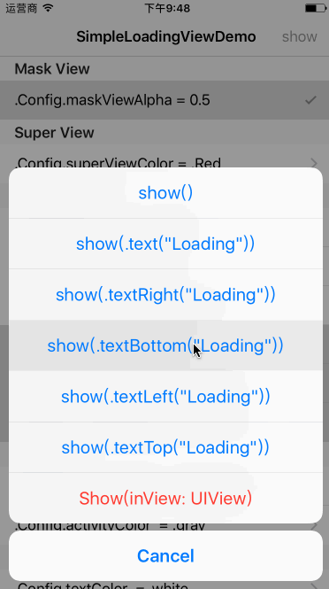

# SimpleLoadingView

[![Swift Version][swift-image]][swift-url]
[](https://github.com/Carthage/Carthage)
[](http://opensource.org/licenses/MIT)

A simple, lightweight and customizable loading interface for iOS written by Swift.



---

## Requirements

- iOS 8.0+
- Xcode 8.0+

## Installation

### Carthage (Recommend)
[中文简易教程`Github](https://github.com/pangpingfei/SwiftBlog/blob/master/Others/Carthage.md) | [中文简易教程`Jianshu](http://www.jianshu.com/p/ab2768af4d94) 

Create a `Cartfile` that lists the framework and run `carthage update`. Follow the [instructions](https://github.com/Carthage/Carthage#if-youre-building-for-ios) to add `$(SRCROOT)/Carthage/Build/iOS/SimpleLoadingView.framework` to an iOS project.

```
github "pangpingfei/SimpleLoadingView"
```

Run `carthage update --platform iOS` to build the framework and drag the built `SimpleLoadingView.framework` into your Xcode project.

To get the full benefits import `SimpleLoadingView`

``` swift
import SimpleLoadingView
```

### Manually
1. Download and drop ```SimpleLoading.swift``` ```SimpleLoadingView.swift``` ```SimpleLoadingView.xib``` in your project.  
2. Congratulations!  

## Usage

### Basic

```swift
	// show activity only
	SimpleLoading.show()

	// show text only
	SimpleLoading.show(.text("Welcome!"))

	// show activity with text
	SimpleLoading.show(.textRight("Loading"))

	// show in other view
	SimpleLoading.show(inView: self.view)

	// hide view manually
	SimpleLoading.hide()

	// hide view after duration
	SimpleLoading.show(duration: 2)

```
> You can see all styles in public enum `SimpleLoading.Style` .

### Customizable

```swift
	SimpleLoading.Config.maskViewAlpha = 0.5
	SimpleLoading.Config.viewBorderWidth = 1
	SimpleLoading.Config.activityStyle = .whiteLarge
	SimpleLoading.Config.textColor = .white
	SimpleLoading.Config.verticalPadding = 30
	// ...
```
> You can see all settings in public struct `SimpleLoading.Config` .

### Spacing, margin, padding

https://github.com/pangpingfei/SimpleLoadingView/raw/master/Screenshots/Desc.png

### More...

>For more information please see the demo in project.

## License
SimpleLoadingView is available under the MIT license. See the [LICENSE file](https://github.com/pangpingfei/SimpleLoadingView/blob/master/LICENSE).

[swift-image]:https://img.shields.io/badge/swift-3.0-orange.svg
[swift-url]: https://swift.org/